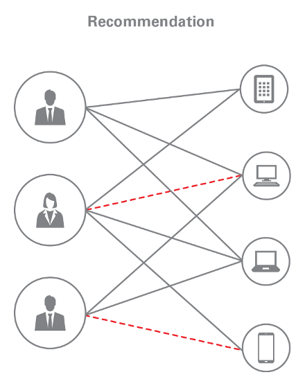

# Movie Recommendation



Graph analytics is becoming popular, but there are things you can do with it that are far beyond the sorts of things people intuit when they think of graphs.

Obvious applications of graph analytics are things like taking your Facebook friends graph, and finding people you aren't directly connected to but might know, because they're connected to a lot of your friends. In that sort of graph, vertices are homogeneous - there is only one kind - a person. And in fact, graph analytics is easily applicable to any data set where entities reference other entities of the same type.

But some of the most interesting applications of graph analytics involve working with data sets where vertices are heterogenous. Vertices of type A are connected to vertices of type B (and add as many additional vertex types as you like) - that data is just as easily represented as a graph.

The thing that graph analytics brings to the table is the ability to discover latent information implied by the relationships expressed in data. It's hard to overstate the game-changing implications of that. What it provides is an empirical way to do things that used to be solely in the realm of human intuition - whether it's judging how risky a source code commit is, or picking a movie someone would like.

One such example is exactly that - recommendation engines, using [matrix factorization](https://ieeexplore.ieee.org/document/5197422). For the examples here, we will use the publicly available [MovieLens](https://movielens.org/) data set. In this case study, we'll use Oracle Labs' PGX graph analytics engine to create a recommendation engine with very little code. We start with a brief introduction to [Matrix Factorization for Recommendations](#matrix-factorization-for-recommendations) and continue with [Implementing A Recommendation Engine with PGX](#implementing-a-recommendation-engine-with-pgx). If you would rather skip the explanation and directly go to the usage instructions, you can skip aforementioned sections and go straight to [Running the Example Code](#running-the-example-code).

## Matrix Factorization for Recommendations <a name="matrix-factorization-for-recommendations"></a>

Matrix factorization is a relatively simple process - say you have a matrix of numbers (with dimensions N x M),

```
|---|---|
| 3 | 1 |
| 5 | 7 |
```

you could factor that into two matrices, with dimensions F x N and F x M, as follows (here F is the latent feature dimension).

```
|----|----|    |----|----|
| 1  | -1 |    | -1 | -3 |
| 2  |  2 |    |  2 |  2 | 
```

So, say we have a matrix of movies and users, with the values being ratings, and with blanks for movies a user hasn't rated.

| -        | Star Wars | Dog Day Afternoon | Blue Velvet | The Toxic Avenger |
|----------|-----------|-------------------|-------------|-------------------|
| Alice    | 1         | 1                 | 5           | 4                 |
| Bob      | 1         | -                 | -           | 4                 |
| Jack     | 5         | 1                 | 3           | -                 |

We might actually have many thousands of users and ratings here.  How would performing a bunch of division help us?

The idea here is that every user has a few other pieces of information tied to it - say, age, and occupation.  And every
movie has information tied to it as well - genre, actors, year it came out.  Now, one could apply some intuition and posit that,
say, someone whose occupation is "engineer" has a higher probability of liking science fiction.  And people have tried to
write systems that hard-coded a whole lot of suppositions - but the results of that approach have never been stellar.  And of
course, just recommending the most popular movies is a cheap way to solve the problem, but it means everybody gets the same
recommendations, even though not everybody likes the same things.

The insight - that users who share some characteristics and movies that share some characteristics, plus a set of
ratings, encode latent information that is predictive of what a user will like is sound.  Now, what if you could
generically make recommendations, without having to hard-code any assumptions about those attributes, or even have to
know what they are?  That's what this approach to recommendations offers.  The analysis involved is a two-step process:

 * Discovering (really, synthesizing) an array of _features_ - a _feature_ might take into account any of the things we know about the user, the movies they rated and their rating of them - a feature might be "rates action movies highly" - in practice, this is just an array of floating-point numbers - this is the training step - we'll synthesize a new property on both movie and user entities.  The thing that's non-intuitive here is that a feature is neither a feature of a movie nor of a user, but rather, describes the kind of relationships the user has to movies or vice-versa.  Essentially, we've synthesized some shared data to compare based on looking at a large number of connections (ratings) between users and movies.
    * Each user winds up with an array of floating-point values, one per feature, that represents how strongly they are associated with this feature
 * When we want to generate recommendations for a particular user, we iterate the movies (or some subset of them) and simply multiply the user's feature array by the movie's feature array, then descending-sort the movies by that number, pick a handful of items off the top, and those are the recommendations.  And the process also works in reverse - if you had a movie and wanted to send out emails to people who are likely to watch it, you just do the same operation starting from a movie instead of a user.

So essentially the entire process of generating recommendations for _anything_ is boiled down to a bit of straightforward, if a bit complicated, math.

Where matrix factorization actually enters the picture is the training step.  We search - biased by some initial values, such as the number of features to discover and a maximum number of iterations - for two matrices which, when multiplied, approximate that original ratings matrix.  One matrix has a row for each movie and a column for the strength with which that movie has each feature, and the other matrix has a row for each user and the strength with which they have each feature.  The idea being that if you multiplied these two matrices, you'd get back something close to the original matrix.

| -                 | Feature 1 | Feature 2         | Feature 3   | Feature 4 |
|-------------------|-----------|-------------------|-------------|-----------|
| Star Wars         | 0.25      | 0.8               | 0.01        | 0.053     |
| Blue Velvet       | 0.96      | 0.325             | 0.13        | 0.46      |
| Dog Day Afternoon | 0.21      | 0.1               | 0.87        | 0.83      |
| The Toxic Avenger | 0.64      | 0.23              | 0.1         | 0.74      |

| -     | Feature 1 | Feature 2 | Feature 3  | Feature 4 |
|-------|-----------|-----------|------------|-----------|
| Alice | 0.25      | 0.8       | 0.01       | 0.053     |
| Bob   | 0.96      | 0.325     | 0.13       | 0.46      |
| Jack  | 0.21      | 0.1       | 0.87       | 0.83      |

The interesting thing about this is that _we don't have to care about what the features are_.  It can certainly be useful to look at them and see what goes into them - when you read about Orwellian predictions made by insurance and credit card companies, such as being able to surprisingly accurately determine who is likely to get divorced based on their purchases, it's pretty likely that this is the sort of analysis they got that from - just build a system that makes accurate predictions, and then look at how the features were computed.  The point is to let the machine discover those relationships, rather than making guesses and encoding those guesses into the system.  That's what allows this to be a generic approach to recommendation generation.  The approach to generating the features is to initialize each matrix with some values, and then iterate over it some number of times and _learn_ by adjusting the values until the product really would match the original matrix to some degree of accuracy (which you can set).  This is not a cheap process (although it's surprisingly fast in PGX on a decent laptop) but you do it _once_, then use the result for many recommendations, repeating the process periodically after new users or movies have been added to the system.

## Implementing A Recommendation Engine with PGX <a name="implementing-a-recommendation-engine-with-pgx"></a>

### Getting the Movie Data

The movie data we will use can be downloaded from [MovieLens](https://movielens.org/).
The MovieLens data comes as a zip file that contains a set of plain-text data files.
To follow along with this tutorial, download [ml-latest-small.zip](http://files.grouplens.org/datasets/movielens/ml-latest-small.zip) from the [MovieLens datasets](https://grouplens.org/datasets/movielens/) page and extract `ml-latest-small.zip` to some writable directory, e.g. `/tmp/data`.

### Loading the Movie Data Into PGX

The following code is taken from [MovieRecommender.java](src/main/java/oracle/pgx/algorithms/MovieRecommender.java) and is responsible for loading the graph data into PGX.
The code starts by programmatically creating a PGX session (which implicitly launches PGX in embedded mode).
The code continues to shuffle the ratings to avoid any bias due to ordering of the data in the input file.
The code then splits the users and movies into a training- and test graph and loads each graph into PGX.

```java
public class MovieRecommender {
  public static void main(String[] args) throws Exception {
    Path inputDir = Paths.get(args[0]);

    try (PgxSession session = Pgx.createSession("pgx-algorithm-session")) {
      Path data = prepare(inputDir);

      FileGraphConfig trainingConfig = getGraphConfigBuilder()
          .addEdgeUri(data.resolve("ratings-training.csv").toString())
          .addVertexUri(data.resolve("movies-training.csv").toString())
          .addVertexUri(data.resolve("users-training.csv").toString())
          .build();

      PgxGraph trainingGraph = session.readGraphWithProperties(trainingConfig);

      FileGraphConfig testConfig = getGraphConfigBuilder()
          .addEdgeUri(data.resolve("ratings-test.csv").toString())
          .addVertexUri(data.resolve("movies-test.csv").toString())
          .addVertexUri(data.resolve("users-test.csv").toString())
          .build();

      PgxGraph testGraph = session.readGraphWithProperties(testConfig);
    }
  }

  private static Path prepare(Path inputDir) {
    try {
      Path tempDir = Files.createTempDirectory("pgx-algorithm-sample");

      Path[] ratings = splitRatings(inputDir, tempDir);
      createUsers(ratings[0], tempDir.resolve("users-training.csv"));
      createUsers(ratings[1], tempDir.resolve("users-test.csv"));
      createMovies(ratings[0], tempDir.resolve("movies-training.csv"));
      createMovies(ratings[1], tempDir.resolve("movies-test.csv"));

      return tempDir;
    } catch (IOException e) {
      throw new RuntimeException("Cannot create a temporary directory.", e);
    }
  }

  private static Path[] splitRatings(Path inputDir, Path tempDir) {
    Path path = inputDir.resolve("ratings.csv");

    try {
      List<String> lines = Files
          .lines(path)
          .skip(1)
          .collect(Collectors.toList());

      // Shuffle the lines to avoid bias in partitioning
      Collections.shuffle(lines);

      // Partition on 80%/20% basis
      long rows = lines.size();
      long testSize = rows / 5;
      long trainingSize = rows - testSize;

      Stream<String> training = lines.stream().limit(trainingSize);
      Stream<String> test = lines.stream().skip(trainingSize);

      // Create the training- and test files
      Path ratingsTraining = createRatings(training, tempDir.resolve("ratings-training.csv"));
      Path ratingsTest = createRatings(test, tempDir.resolve("ratings-test.csv"));

      return new Path[] {
          ratingsTraining,
          ratingsTest
      };
    } catch (IOException e) {
      throw new RuntimeException("Unable to read the ratings.", e);
    }
  }

  private static Path createRatings(Stream<String> lines, Path outputPath) {
    Path output = createOutputFile(outputPath);

    try (Writer writer = writer(output)) {
      lines.map(Splitter.comma).forEach(columns ->
        writeln(writer, "1" + columns[0] + ",2" + columns[1] + "," + columns[2] + "," + columns[3])
      );

      return output;
    } catch (IOException e) {
      throw new RuntimeException("Unable to create output file.", e);
    }
  }

  private static void createUsers(Path inputFile, Path outputFile) {
    Path output = createOutputFile(outputFile);

    try (Stream<String> lines = Files.lines(inputFile); Writer writer = writer(output)) {
      lines.map(Splitter.comma).map(atIndex(0)).distinct().forEach(user ->
          writeln(writer, user + ",true")
      );
    } catch (IOException e) {
      throw new RuntimeException("Unable to read the users.", e);
    }
  }

  private static void createMovies(Path inputFile, Path outputFile) {
    Path output = createOutputFile(outputFile);

    try (Stream<String> lines = Files.lines(inputFile); Writer writer = writer(output)) {
      lines.map(Splitter.comma).map(atIndex(1)).distinct().forEach(movie ->
          writeln(writer, movie + ",false")
      );
    } catch (IOException e) {
      throw new RuntimeException("Unable to read the movies.", e);
    }
  }

  public enum Splitter implements Function<String, String[]> {
    tab {
      @Override
      public String[] apply(String s) {
        return s.split("\t");
      }
    },
  
    comma {
      @Override
      public String[] apply(String s) {
        return s.split(",");
      }
    }
  }
}
```

You can run this code by providing it the path to the extracted MovieLens data (e.g. `/tmp/data`) as its sole argument (e.g. `java MovieRecommender /tmp/data`).

### Implementing Training in PGX Algorithm

PGX includes a language _PGX Algorithm_ which is specifically designed to make graph analytics simple to write.
Under the hood, it is compiled to high-performant parallel Java bytecode (or C++ code in distributed PGX).
It contains primitives for common entities and operations, and allows you to focus on the analytics you want to write, rather than the plumbing code that most languages would need to do what it does.

The following algorithm starts by assigning every vertex a vector of length `vector_length` with uniformly distributed double values.
The algorithm then computes for every edge (i.e. every user rating a movie) the current estimate rating (the dot product between the user's vector and the movie's vector) and comparing it with the actual rating.
The user's vector and movie's vector are then modified to bring the estimated rating slightly closer to the actual rating.
This gradient descent operation is repeated for at most `max_step` steps.

```java
package oracle.pgx.algorithms;

@GraphAlgorithm
public class MatrixFactorizationGradientDescent {
  public double matrix_factorization_gradient_descent(
      PgxGraph G,
      VertexProperty<Boolean> is_left,
      EdgeProperty<Double> weight,
      double learning_rate,
      double change_per_step,
      double lambda,
      int max_step,
      int vector_length,
      @Out VertexProperty<@Length("vector_length") PgxVect<Double>> features) {

    G.getVertices().forSequential(n -> {
      features.set(n, uniformVector());
    });

    Scalar<Double> rate = Scalar.create(learning_rate);
    int counter = 0;
    Scalar<Double> root_mean_square_error = Scalar.create(0.0);

    while (counter < max_step) {
      root_mean_square_error.set(0.0);
      G.getEdges().forEach(e -> {
        PgxVertex src = e.sourceVertex();
        PgxVertex dst = e.destinationVertex();

        double rating = weight.get(e);
        double estimate = features.get(src).multiply(features.get(dst));

        features.set(src, features.get(src).add(features.get(dst).multiply((rating - estimate) * rate.get())
            .subtract(features.get(src).multiply(lambda * rate.get()))));
        features.set(dst, features.get(dst).add(features.get(src).multiply((rating - estimate) * rate.get())
            .subtract(features.get(dst).multiply(lambda * rate.get()))));

        root_mean_square_error.reduceAdd((rating - estimate) * (rating - estimate));
      });
      rate.reduceMul(change_per_step);
      counter++;
    }

    return sqrt(root_mean_square_error.get() / (G.getNumEdges() * 1.0));
  }
}
```

### Implementing Recommendations in PGX Algorithm

What's left is to compile the above PGX Algorithm code and run it on our MovieLens graph.
The result of running this algorithm is a feature vector for every user and every movie.
To estimate a user's rating for a movie, all we need to do is compute the dot product of the user's feature vector and the movie's feature vector.
To recommend three movies that the user is likely to watch, we would estimate a rating for every movie and return the three movies with the highest estimated rating.

The complete code that loads the graph, compiles the Movie Recommendation algorithm, and runs it on the MovieLens graph is quite large.
For this reason we omit the code from this description, but we invite the reader to look at [MovieRecommender.java](src/main/java/oracle/pgx/algorithms/MovieRecommender.java).

## Built-in Recommendation Support in PGX

Since version 1.2.0, PGX has above matrix factorization algorithms built-in.
The `Analyst` class provides the following methods to perform the factorization step:

```java
PgxFuture<MatrixFactorizationModel<ID>> matrixFactorizationGradientDescentAsync(
    BipartiteGraph graph,
    EdgeProperty<Double> weightProperty,
    double learningRate,
    double changePerStep,
    double lambda,
    int maxStep,
    int vectorLength)
```

The methods return a `MatrixFactorizationModel` object that provides a method `getEstimatedRatingsAsync` to compute estimated ratings for a specific vertex:

```java
PgxFuture<VertexProperty<ID, Double>> getEstimatedRatingsAsync(PgxVertex<ID> estimateRatingsFor)
```

## Running the Example Code <a name="running-the-example-code"></a>

The Movie Recommendation example operates on the [MovieLens](https://grouplens.org/datasets/movielens/) data set.
To run the example:

1. Download [ml-latest-small.zip](http://files.grouplens.org/datasets/movielens/ml-latest-small.zip) from the [MovieLens datasets](https://grouplens.org/datasets/movielens/) page. <!-- `wget -O /tmp/ml-latest-small.zip http://files.grouplens.org/datasets/movielens/ml-latest-small.zip` -->
2. Extract `ml-latest-small.zip` to some writable directory `/tmp/foo/bar`. <!-- `unzip /tmp/ml-latest-small.zip -d /tmp/` -->
3. Run `gradle run -Pdata="/tmp/foo/bar"` for training a model and testing it. Or run `gradle run -Pdata="/tmp/foo/bar" -PuserID=1 -PtopK=10` for training, testing and generate recommendations, where `-PuserID` must be a valid user ID from the `userId` column of the `ratings.csv` file in the dataset, and `-PtopK` is the number of ranked and recommended movies to show as example. <!-- gradle run -Pdata="/tmp/ml-latest-small" -PuserID=1 -PtopK=10 -->

This command runs the `oracle.pgx.algorithms.MovieRecommender` class, which:

1. Prepares the graph data
 1. Shuffles the ratings. In step (2) the ratings are partitioned; by shuffling we avoid bias in the test graph.
 2. Partitions the edges (ratings) into two sets: training (80%) and test (20%).
 3. Prepends a "1" to user IDs and a "2" to movie IDs to ensure that all vertex IDs are unique.
 4. Adds an `is_left` property which is `true` for users and `false` for movies.
2. Loads the training- and test graph.
3. Compiles the Matrix Factorization Gradient Descent algorithm, runs it on the training graph and prints its Root Mean Squared Error (RMSE) associated.
4. Computes and prints the Root Mean Squared Error (RMSE) for the test set.

This computes a RMSE of 0.88, similar to the RMSE that can be obtained with different algorithms.
