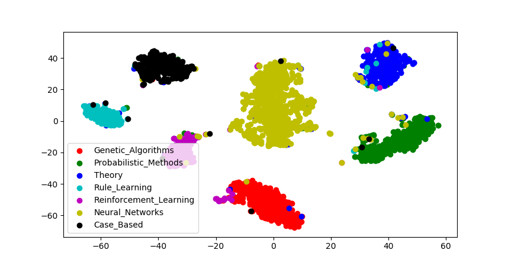

Note: this example makes use of the new `SupervisedGraphWise` classifer, which is available in PGX 19.4.0.
# Research Paper Classification - Cora Dataset
Graph analytics often allows you to leverage relational information that other, classical models simply have no
effective way of capturing. One example of such data is the citation network of research papers.

## The Cora dataset
The Cora dataset consists of 2708 machine-learning research papers which have been labeled with one of seven topics.
Each paper has a 1433 dimensional binary feature vector, where 0/1 indicates the absence/presence of selected words from
the dictionary. Additionally, the dataset provides the citation graph, where each edge represents a citation between two
research papers.

To run this example, download [the dataset](https://linqs-data.soe.ucsc.edu/public/lbc/cora.tgz) and extract the
files `cora.cites` and `cora.content` into the `data/graph/cora` directory. 
`cora.content` contains the vertex (research paper) feature vectors, and `cora.cites` contains the edges.

## Running the example
The example can be run using the command `./gradlew run`. This will perform the following steps:
1. Load the Cora graph into the PGX server
2. Create a train-test split
3. Train a `SupervisedGraphWise` model on the training graph
4. Evaluate the trained model on the unseen test nodes
5. Infer and save embeddings for all vertices into `embeddings.csv`

## Evaluating the results
We can see that the model performs quite well on the test set: the following is example evaluation output:

|--------------------|--------------------|--------------------|--------------------|
| Accuracy           | Precision          | Recall             | F1-Score           |
|--------------------|--------------------|--------------------|--------------------|
| 0.869              | 0.867              | 0.846              | 0.854              |
|--------------------|--------------------|--------------------|--------------------|

The hyper parameters of the model have been left to the default settings, but can of course be tuned to optimize the
performance.

## Visualizing the Embeddings
The embeddings themselves can be used for other downstream tasks, such as cluster or link prediction. To visualize them
in an understandable manner, we can generate and plot t-SNE vectors for the vertices. The following figure is the result.

