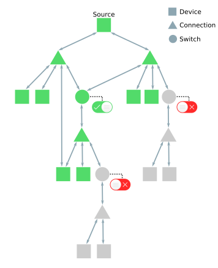
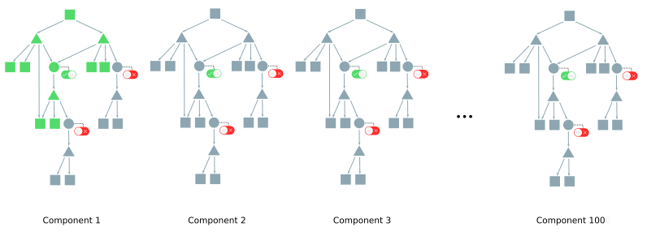
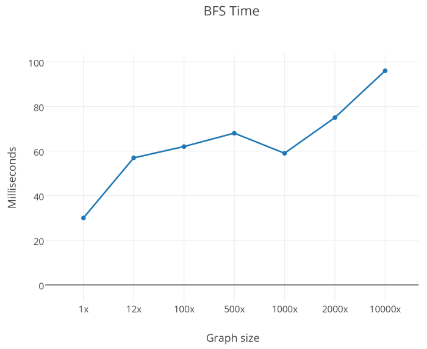

# Modeling an Electric Network With PGX

In this use-case, we show how to model an electricity distribution network using PGX. Simulations can be performed over this model to determine the reliability of the network and to predict network configurations that may lead to undesired connectivity losses.

## Electric Network Graph Model

The chosen model to represent the electricity distribution network consists on an undirected graph which nodes can be of three kinds:

1. **Device nodes:** This nodes nodes represent physical devices on the network. Turbines, generators and electric transformers are examples of the objects represented by this kind of node.

2. **Connection nodes:** This nodes represent the direct interaction (connection) among device nodes. For example, to model a turbine connected to a generator the model should include a device node that represents each of them and a connection node that serves as bridge among them.

3. **Switch nodes:** Switch nodes are a special kind of device nodes. They represent physical switches in the network which can be set to an *open* or *closed* configuration. Switch nodes govern how the electricity flows in to the network. If a switch node is *open* then it WILL NOT ALLOW the flow of electricity through it. Only a *closed* switch WILL ALLOW the flow of electricity through it.



*Reachable nodes from source (green) on the electric network model.*

The figure above shows a graphical representation of this model. There, device nodes are represented as squares, connection nodes as triangles and switch nodes as circles. A red interrupter attached to a switch node denotes that such switch node is *open*, if the interrupter is green then the switch node is *closed*. Also, green nodes represent those nodes that are reachable from the source on top. To get the nodes that are reachable from an arbitrarily selected source node, a Breadth First Search can be performed from it. By restricting the BFS traversal to not pass through the *open* nodes, the reachable nodes are obtained.

## Dataset Description

The dataset is available in `data` folder and are provided as three CSV files with several fields of different types:

`NodeData-8500.csv` This file contains information regarding device nodes 

+ Node ID                *(long)*
+ Nickname               *(string)*
+ Latitude               *(double)*
+ Longitude              *(double)*
+ Node Parent            *(long)*
+ Base Volts             *(double)*
+ Base Current           *(double)*
+ Base Power             *(double)*
+ Configuration          *(string)*
+ RemoteControlAvailable *(boolean)*
+ SegmentId              *(string)*
+ Upstream Connection    *(string)*
+ Downstream Connection  *(string)*
+ Phase                  *(string)*
+ Nominal Feeder         *(long)*

`ConnectData-8500.csv` This file contains information regarding connection nodes, each connection can connect up to 8 devices. In this file all of the edges of the graph are encoded.

+ Connect ID  *(long)*
+ Node A      *(long)*
+ Node B      *(long)*
+ Node C      *(long)*
+ Node D      *(long)*
+ Node E      *(long)*
+ Node F      *(long)*
+ Node G      *(long)*
+ Node H      *(long)*

`SwitchConfig-8500.csv` This file contains information regarding the configuration of  device nodes that serve as switches. 

+ Configuration    *(string)*
+ Normal Position  *(string)* 

## Building a Graph from the Dataset

Before we use the PGX shell to process the datasets we must define how the resulting graph is going to be structured. For this purpose, PGX relies on a graph definition JSON file. This file describes the properties of the nodes and edges of the graph, it also defines the format of the graph and the source its data. For more information read the [graph configuration reference](reference/loader/graph-config/index.html).

The configuration JSON file that sets the graph that represents the model explained before is defined below. From the JSON file several things can be noticed:

+ First, notice that all the nodes include all the properties for all of the three kinds of nodes indistinctly. This is because for simplicity we use homogenious PGX graph format. There is also [heterogenous format]() where nodes can have differet sets of properties.

+ Second, notice that the JSON file specifies the format of the file to be *edge_list*. The edge list format is a plain text format used by PGX to represent graphs. Please read about [plain text formats](reference/loader/file-system/plain-text-formats.html) to better understand the inner details of edge lists.

+ Finally, notice the property named "node_class". This property allows us to distinguish between node types --- devices, connections and switches by respectively assigning them the values of 0, 1 and 2.

The JSON configuration file is stored in `use-cases/electric-network/data/electric_graph.edge.json` ([show online](data/electric_graph.edge.json)).

Now, when the configutation file is ready, let's convert the raw data to the graph format. We have prepared a Groovy script to convert the data. The script is located in `use-cases/electric-network/src/buildGraph.groovy` ([show online](src/buildGraph.groovy)). To run the preprocessing script, open a terminal and change directory to `use-cases/electric-network/src`. Then run

```bash
pgx buildGraph.groovy
```

and wait for it to finish. Then type `exit` (or press `Ctrl+D`) to close the PGX shell. Now you should have a new file in the directory named `use-cases/electric-network/data/electric_graph.edge`, this file contains the nodes and edges that compose the electric network graph.

```groovy
g = session.readGraphWithProperties("electric_graph.edge.json")
```

## Retrieving Reachable Nodes from a Source With BFS

Once we have generated the graph for the electrical network model, it is time to perform some simulations on it to study its connectivity. As discussed in the first section of this use case, we will perform a modified version of Breadth First Search (BFS) on the graph starting from a source node to determine which nodes can be reached from such source node.

BFS is an algorithm for traversing a graphs. It starts at some arbitrary node sometimes referred to as *source node* and explores its neighbor nodes first, then it moves to the next level of neighbors and repeats the process. However, we are interested in modifying BFS to obey the additional restriction of not trespassing those nodes that represent *open* switches. To achieve this we wrote a custom Green-Marl program. Green-Marl is a domain specific language specially tailored to write graph related programs. It naturally takes advantage of the available parallel execution capabilities of PGX's architecture.

The graph traversal Green Marl program is stored in `use-cases/electric-network/src/bfs_reachable.gm` ([show online](src/bfs_reachable.gm)).

The steps executed by the Green-Marl program are:

+ The program receives as input arguments a graph `G`, a source node `s`, and boolean node property `switch_default`. It also receives an integer node property `bfs_parent`, and node typed node property `bfs_parent` which are interpreted as output reference arguments.

+ The program starts by setting the `bfs_level` property to -1 for each of the nodes in the graph `G`.

+ Then, the instruction `inBFS(v: G.nodes from s)[v.switch_default==true]` states that a BFS traversal will be performed from the source node `s` but only navigating through nodes `v` which property `switch_default` is set to `true`.

+ Finally, for each node `v` that is part of the traversal the properties `bfs_level` and `bfs_parent` are set by the functions `currentBFSLevel()` and `BFSParentNode()` respectively.


The Green Marl program will be compiled and run using the PGX Shell. We have prepared another Groovy script to load the graph, prepare properties required for the Green Marl program, compile the program and execute it. The script is available in `use-cases/electric-network/src/getReachablePGQL.groovy` ([show online](src/getReachablePGQL.groovy)). To run the script, open a terminal, move to `use-cases/electric-network/src` and run 

```bash
pgx getReachablePGQL.groovy
```

The script does following steps:

+ Define the path to the network graph file as well as the intended path for the CSV report.

+ Load the electric network model graph and undirected it.

+ Create two properties, `bfs_parent` and `bfs_level`, that will serve as containers for the output of the custom BFS Green-Marl program defined before.

+ Select a source node `s` from the graph. In this example we are starting from the node numbered `21474836490`.

+ Compile the program stored in `bfs_reachable.gm`  to an object named `gm_bfs`. Then execute the traversal and save the execution summary to a dictionary named `execution_summary_dic`.

+ Once the traversal has been executed over the graph, those reached nodes should have their `bfs_level` property set to a number equal or greater than 0. To retrieve the traversed nodes the PGS script will perform the following PGQL query:

    + `SELECT n, n.bfs_level MATCH (n) WHERE n.bfs_level >= 0 ORDER BY n.bfs_level`

+ Iterate over the results of the PGQL query and save them to the CSV report.

+ Print the measured times for each of the stages.


When the script is completed, you should see an output similar to what is shown below.

```bash
==> 	Graph loading time: 0.933 seconds
==> 	BFS elapsed time: 30 millisenconds
==> 	PGQL execution time: 253 milliseconds
==> 	Reached nodes: 10911
==> 	Report saving time: 0.992 seconds
==> 	Total vertices: 10916
==> 	Total edges: 21860
==>

==> 	Type exit to quit ...
```

The execution of the script produced a file named `use-cases/electric-network/data/reachable_subgraph.csv`, it encodes the traversed route from the source to each of the reached nodes in a tabular format. This file can be opened with any spreadsheet program. The first 10 rows of the resulting table are shown below.

|n	         |n.bfs_level |	n.bfs_parent|
|------------|------------|-------------|
|21474836490 |0           |-1           |
|6001        |1           |21474836490  |
|38654705676 |2           |6001         |
|38654705675 |2           |6001         |
|38654705677 |2           |6001         |
|6002        |3           |38654705676  |
|30064771113 |4           |6002         |
|6003        |5           |30064771113  |
|8589934822  |6           |6003         |

As the results show, our modified BFS algorithm traversed 10911 nodes, we can modify the configuration of some switch nodes to change the result. Let `s1` and `s2` be the switch nodes corresponding to the nodes with id numbers *8589937331* and *8589937325* respectively. Both of this nodes have their `switch_default` property set to `true`, by changing it to `false` they will not allow the flow of energy through them in the simulation. Add the following lines `getReachablePGQL.groovy` just beneath the source selection instruction `s = g.getVertex(21474836490)` in line 15 and save the changes.

```groovy
sw1 = g.getVertex(8589937331)
sw2 = g.getVertex(8589937325)

switch_default = g.getVertexProperty("switch_default")
switch_default.set(sw1, false)
switch_default.set(sw2, false)
```

To finish the use case, run again the `getReachablePGQL.groovy` script and look at the results below. As you may notice the restriction made to the switch nodes `sw1` and `sw2` prevented the BFS traversal to pass through them, thus reducing the number of nodes reachable from the source.

```bash
==> 	Graph loading time: 0.921 seconds
==> 	BFS elapsed time: 31 millisenconds
==> 	PGQL execution time: 251 milliseconds
==> 	Reached nodes: 10721
==> 	Report saving time: 0.971 seconds
==> 	Total vertices: 10916
==> 	Total edges: 21860
==>

==> 	Type exit to quit ...
```

Remove the changes made to `getReachablePGQL.groovy` and proceed to the next section.


## Testing PGX Over Large Electric Network Models

PGX is a fast, parallel, in-memory graph analytics framework. This parallelization capability allows it to operate efficiently over large graphs without noticeable loss of performance.

To test the scalability of PGX we can scale up the original electrical network model and repeat the custom BFS traversal over this new graph. This scaling can be done by recreating the original structure of the electrical network graph constructing several unconnected components. For this example we are going to scale the model to a model 100 times larger. The figure below exposes the idea of the BFS algorithm running on the scaled model. Notice how the number of reached nodes does not increase since the BFS is confined to a single component.



*Scaled model with 100 components*

This whole procedure is done by the `use-cases/electric-network/src/multiplyGraph100x.groovy` ([see online](src/multiplyGraph100x.groovy)).

Basically the script reads `electric_graph.edge` and saves 100 nodes for each of the nodes in it. This is done by adding an offset value to each of the node identification numbers for every time the original node is multiplied. The process is repeated for each of the edges in the file as well. The final result is saved to `electric_graph100x.edge`.

To be able to read in the graph, a new JSON configuration file is also required - `use-cases/electric-network/data/electric_graph.edge100x.json` ([see online](data/electric_graph.edge100x.json)). The only difference is the change in the file location, otherwise the configuration file is identical to the `electric_graph.edge.json`.

Now you have an electrical network graph 100 times larger than the original.

Now we can test our `getReachablePGQL.groovy` script over the new graph. To point the script to the new files, update the second and third lines in the script to

```
graph_path  = "../data/electric_graph.edge100x.json"
output_path = "../data/reachable_subgraph.100x.csv"
```

 When done, run the script from the PGX shell. You should get a result similar to the one below.

```bash
==> 	Graph loading time: 2.7 seconds
==> 	BFS elapsed time: 62 millisenconds
==> 	PGQL execution time: 264 milliseconds
==> 	Reached nodes: 10911
==> 	Report saving time: 1.021 seconds
==> 	Total vertices: 1091600
==> 	Total edges: 2186000
==>

==> 	Type exit to quit ...
```

Notice how the BFS execution time barely doubled despite the fact that the graph in memory was 100 times larger than the original. You can repeat what you learned on this section to perform the same experiment over graphs even larger but for your convenience we have performed it over graphs 12, 100, 150, 500, 1000, 2000 and 10000 times larger. The results can be seen in the next table.

|Data Size	|Vertices	|Edges		|Reached nodes	|Loading time (secs)	|BFS time (ms)	|PGQL time (ms)	|
|-----------|-----------|-----------|---------------|-----------------------|---------------|---------------|
|1x			|10916		|21860		|10911			|0.719					|30				|266			|
|12x		|130992		|262320		|10911			|1.258					|57				|258			|
|100x		|1091600	|2186000	|10911			|2.701					|62				|264			|
|500x		|5458000	|10930000	|10911			|7.731					|68				|265			|
|1000x		|10916000	|21860000	|10911			|21.974					|59				|220			|
|2000x		|21832000	|43720000	|10911			|41.642					|75				|318			|
|10000x *	|109160000	|218600000	|10911			|37.452					|96				|323			|


For the 10000 times larger graph we dropped all the node properties of the graph, except the switch_default property (since that is the one this analysis uses). The BFS column of the table generates the next plot.



# Summary
+ PGX can be easily used to model complex networks such as those that represent electrical distribution networks.

+ Green-Marl allows the user to write complicated graph routines in a simple elegant way that will take full advantage of the parallel capabilities of the machine where the program is run.

+ PGX can perform operations over very large graphs with high performance.


